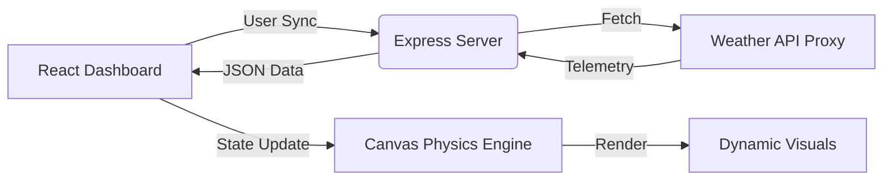

# Supernova Weather Simulator 🌌

A premium full-stack atmospheric dashboard showcasing real-time weather synchronization, dynamic physics-based simulations, and high-fidelity glassmorphic UI.


## 🚀 Overview

Supernova Weather Simulator is more than just a weather dashboard. It's a technical showcase of modern web engineering, featuring an interactive HTML5 Canvas engine that responds in real-time to atmospheric telemetry from a Node.js backend.

## ✨ Key Features

- **Full-Stack Synchronization**: Node.js/Express backend fetches real-world atmospheric data and feeds it directly into the simulation engine.
- **Dynamic Physics Engine**: Custom-built particle system handles Rain, Snow, and Storm effects with realistic wind-velocity vectors.
- **Premium Glassmorphic UI**: High-fidelity design system utilizing backdrop filters, curated HSL color palettes, and modern typography (`Outfit` & `Inter`).
- **Real-Time Telemetry**: Users can manually override environmental variables (Precipitation, Wind Speed) or sync to any global location via search.

## 🛠️ Tech Stack

### Frontend
- **Framework**: React 18+
- **Visuals**: HTML5 Canvas API (Particle Systems)
- **Styling**: Vanilla CSS3 (Custom Design Tokens)
- **Build Tool**: Vite

### Backend
- **Environment**: Node.js
- **Server**: Express
- **API Integration**: Axios for external weather proxies
- **CORS**: Cross-origin security enabled

## 🏗️ Architecture



## ⚙️ Installation & Setup

1. **Clone the repository**
2. **Install dependencies**
   ```bash
   npm install && cd server && npm install
   ```
3. **Run the Backend** (From `/server`)
   ```bash
   node server.js
   ```
4. **Run the Frontend** (From root)
   ```bash
   npm run dev
   ```

---
*Built with ❤️ as a technical portfolio project.*
